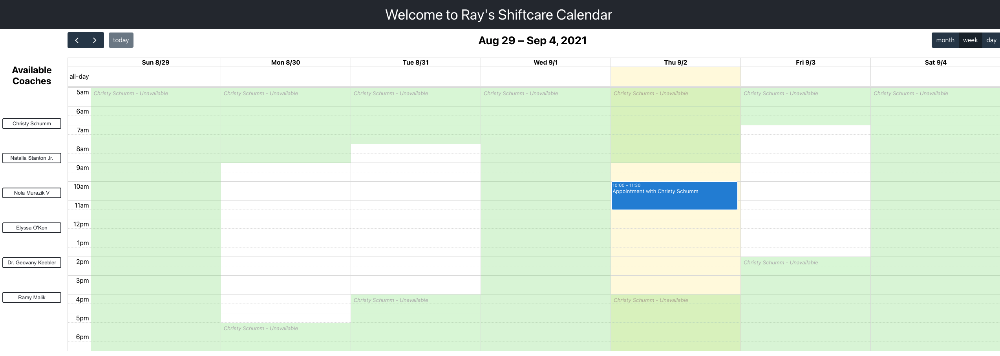

# ShiftCare Challenge

## Created by **Raymond Doan**, *aspiring* Frontend Developer at ShiftCare

## Deployed Application

[Click here to check out the deployed application](https://shiftcare-challenge-ray.netlify.app/)

## Introduction

With the industry increasing the demand for disability and aged care workers, existing tools and utilities are struggling to keep up and properly managing the increasing appointments on the workers' schedules.

This calendar is designed to simplify the booking process for both workers and their clients providing a simple, easy-to-use calendar where clients are able to view coaches, their availabilites and schedule/book in times with the coaches of their choosing.

## Features

- Super easy to setup
- Single Page Application (SPA) design
- Easy to change between coaches, while still being able to see your own bookings
- Distinct contrast in time periods between when coaches are/are not available
- Different views of their bookings (between month, week and daily views)

## Instructions

To install and use Ray's ShiftCare Calendar application:

1. Clone the app using terminal: `git clone https://github.com/raymonddoan/shiftcare-challenge.git`.
2. Once the app has been cloned, change into the directory using: `cd shiftcare-challenge`.
3. Install the dependencies required to run the app using: `yarn install`.
4. Once the dependencies have been installed, you can now start the app using: `yarn start`.
5. To run the tests, use: `yarn test`.

## Architectural Elements and Decisions

### Tech Stack

Ray's ShiftCare Calendar was built on:

- `react` as the front-end framework,
- `fullcalendar` for the calendar component,
- `momentjs` for configuring the time formats to be read by `fullcalendar`,
- `styled-components` for styling the components, and;
- `jest` & `react-testing-libary` for the test code and modules.

### Atomic Design

To manage the complexity of the application, I constructed the application by implementing atomic design, with components such as the `Button` and `Container` representing the atoms and `Calendar` and `Sidebar` representing the molecules. The reason for this particular design was to break down the application into more manageable and testable components and hence improve the configurability of the application.

### Full Calendar Plugin

I chose to use the `fullcalendar` plugin for the following reasons:

- The use cases for the plugin were most aligned with the User Stories mentioned in the provided outline. The configurability of the plugin and the clean User Experience were the key factors in using Full Calendar.
- I was aware that ShiftCare was using this plugin for their booking management application so I wanted to use it and challenge myself.

### Styling

I chose the `styled-components` library to style the components for its customisation and interoperability with other languages like ReactNative and Vue.js.

`styled-components` gave me the freedom to create custom React components with CSS, which would be reusable through out the entire project. I chose the library because I was familiar with the plain CSS, which is largely known by UX/UI designers who may work on the project in the future. Also, if the web application was redesigned in another language like Vue.js or as a mobile application using React Native, I used `styled-components` for consistency across different platforms.

## Trade-offs

As an MVP design, there were a number of trade-offs made in the design of the project. These included:

- Significant amount of time was spent learning how to use `fullcalendar` as it was a new plugin I wanted to use.
- For an MVP design, I was unable to finish the tests on the components. If more time was available, I would have worked on completing these tests.

## Learnings

This coding challenge was a great learning experience with having generating clean code, code accessibility and readable documentation. I was challenged into learning how to use `fullcalendar` and `momentjs`, which will help me improve of my app development in the future.
